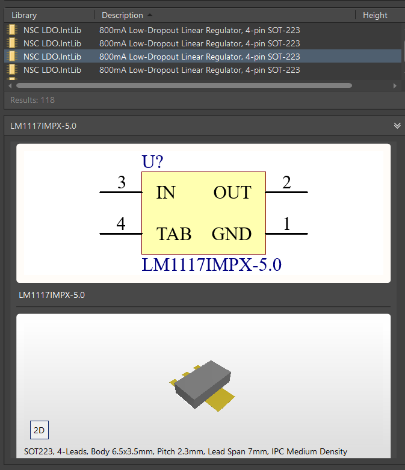

# DOWNLOADABLE LIBS

**Old repo**

As of Sep 13, 2017, individual libraries and also all of them can be downloaded in a zip from [this page](https://techdocs.altium.com/display/ADOH/Download%2BLibraries).

**New repo**

The updated page is now [Octopart](https://octopart.com/electronic-parts).

**Local libs (udemy)**

Thanks to 'Unreal magic' instructor, we have a lot of libraries in this path:

> D:\MyPrograms Plugins\Altium\Libraries

(actually, also in ..\UnifiedComponents, but due to the amount of files, it leads to AD crashes)

## Local libs search

To search for comps contained in them:

1. Open 'main' sheet

2. Open CS

3. Click on the hamburger menu

4. Click on 'File-based libraries search'

5. Choose the scope (what we want to search):

   - Components
   - Footprints
   - 3D models
   - DB Components

6. Mark 'Libraries on path' instead of 'Available libraries'

7. Set the **path above** and verify 'Include subdirectories' option is selected

8. Modify the filters to make a search

   For example,

   | Field | Operator | Value    |
   | ----- | -------- | -------- |
   | Name  | Contains | * 1117 * |

   will search for all comps which have the '1117' string, regardless of the position of that string (if it is at the start, middle or end of a word).

9. Click on search

At the end, if we want to use a comp/footprint, AD will ask us to install the library and we should click on 'yes'.

For example, we could find 'LM1117' and use it, instead of designing it from scratch.

------

# MULTI-SHEET SCHEMATICS

For this example, we'll use a sample library: 'STMicroelectronics STM32 F1.IntLib'

