# CREATE A PROJECT

1. Click on File -> New -> Project.

2. Write project's name.

3. Set file's path.

4. On the left sidebar: 'Projects', right click on the project's name.

5. Click on 'create'

> [!TIP]
>
> Always create a new folder for each new project

> [!TIP]
>
> We can also add **parameters**, like:
>
> *Designer | Alex Alvarez* 
>
> *Start date | 2024*

## Schematic

4. In the left sidebar, right-click on the project and click on **add new to project** -> **schematic**
5. `Ctrl + S`
6. Name the schematic (.SchDoc) as **main**

> [!TIP]
>
> By right-clicking on an empty part of the sheet, we can go to 'project's options' -> 'parameters'.
>
> Also, by opening the 'Properties' right-sidebar we can add more parameters.

### Title Block

7. Right-click on an empty part of the sheet, then select **Place** -> **Text string**
8. On the right-sidebar named 'Properties', write a text.

> [!TIP]
>
> By using `=` we can link the text string to a parameter. For example, for the 'Drawn by: ' cell, we can set the text as '=Designer' or as '=Author'

### Properties sidebar (PS)

While in the 'properties' sidebar, we can:

- Change the **grid units** (mils)
- Select **Enable/disable grid**
- Change **sheet and border color** (white, blue)
- Change **page format**
- Change **page size and orientation** (A3, landscape)
- Select **Enable/disable Title block** (enable, standard)

### Components sidebar (CS)

By default, we have two libraries:

- Miscellaneous devices
- Miscellaneous connectors

There, we can select an element and if we click on `ⓘ` button (it appears by making the sidebar wider), we can see its details, like schematic view, PCB's 2D and 3D views, datasheet, manufacturer, package, pin count, models, etc.

#### Install local library

> [!TIP]
>
> By clicking on `☰` -> 'file-based libraries preferences' -> 'installed', we can add new libraries from our local.

### Upper bar (UB): Selection

In the upper bar, we have some options to select elements inside our sheet.

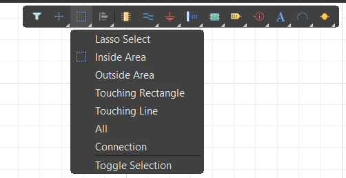

Note: by pressing `Ctrl + C` we can clear all filters applied by any selection, especially useful after using 'connection', which makes all other elements fade.

### Filters

They can be accesed from the 'properties' sidebar (PS) or from the upper bar (UB).

They let us select specific elements contained in the sheet. For example, if we only wanted to delete wires, we'd have:

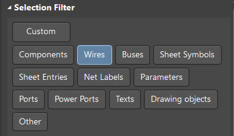

------

# FIRST SCH DESIGN

## Place + Shortcuts

When right-clicking on the sheet, we'll see the 'Place' option with the <u>P</u> underlined. That means we can press `P` in the keyboard to access that option. Then, the same happens with the next options in the menu.

**Common shortcuts are:**

<table style="width: 100%; text-align: center; vertical-align: middle; border-collapse: collapse;">
    <thead>
        <tr>
            <th width="50%">Shortcut</th>
            <th width="50%">Action</th>
        </tr>
    </thead>
    <tbody>
        <tr>
            <td>P + P</td>
            <td>Pin</td>
        </tr>
        <tr>
            <td>P + W</td>
            <td>Wire</td>
        </tr>
        <tr>
            <td>P + O</td>
            <td>Power</td>
        </tr>
        <tr>
            <td>P + T</td>
            <td>Text string</td>
        </tr>
        <tr>
            <td>P + D</td>
            <td>Drawing tools</td>
        </tr>
    </tbody>
</table>

### Drawing Tools (and images)

From `P + D` menu, we can use these combinations aswell:

<table style="width: 100%; text-align: center; vertical-align: middle; border-collapse: collapse;">
    <thead>
        <tr>
            <th width="50%">Key</th>
            <th width="50%">Action</th>
        </tr>
    </thead>
    <tbody>
        <tr>
            <td>L</td>
            <td>Line</td>
        </tr>
        <tr>
            <td>U</td>
            <td>Circle</td>
        </tr>
        <tr>
            <td>R</td>
            <td>Rectangle</td>
        </tr>
        <tr>
            <td>G</td>
            <td>Graphic</td>
        </tr>
    </tbody>
</table>

Graphic lets us add a local image.

> [!IMPORTANT]
>
> When placing an image, go to its properties and checkmark the 'Embedded' option, so it is preserved in our project despite deleting the file from our local.

## Rotate an item

By selecting an element in the sheet, we can rotate elements this way:

- Clockwise: `Space`
- Counterclockwise: `Shift + Space`

## Modify Net's colours

A power port is known as a **net** and we can assign a colour to it by clicking it and going to 'preferences' -> 'General (Net)'.

This allows us to see what do we have connected to a certain port.

## Final design 1 (battery)

Steps:

1. Draw a rectangle

2. Place a text string

> [!NOTE]
>
> Another way to do the former is to place a 'text frame' and customize its text, border and fill, instead of drawing a rectangle and then placing a text string.

3. Place a 'Header 2H' connector (from CS)

4. Place a '+5' power port (from UB) and change its name and style (from properties)

5. Place a 'Cap semi' (from CS)

6. Wire everything

7. Modify the '+5V' net colour to red and the 'GND' port to gray

8. Insert a note

9. Create a folder in workspace named 'assets'

10. Insert an image, from the 'assets' folder

> [!WARNING]
>
> Always verify that items fit correctly into the grid. If they don't, reduce the value of 'Snap grid', move the items and restore the default value again.

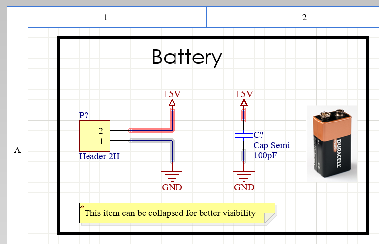

------

# COMPONENT PROPERTIES

The important properties found in '<u>General</u>' are:

- Designator: it identifies the component. An important element here is the `?` mark, which is known as **annotator**, which AD will later change into a number for the PCB footprint.
- Source: it tells us which library the item belongs to. 

The important properties found in '<u>Parameters</u>' are:

- Value: it's the actual value (in ohms, farads, volts, etc) of the element.

------

# CREATE A CUSTOM COMPONENT

Let's suppose we need to use **LM1117** and we don't have it in AD.

## Setting up the Sch Lib and Doc

First:

1. Create a folder in the project's path named '**docs**'
2. Download the **datasheet** and save it into 'docs' folder
3. Look for important characteristics: pins, input, output, configurations, resistors and capacitors needed, etc.

Then, in AD:

4. Go to 'File' -> New -> Library -> File -> Integrated library

5. Right-click on the new created <u>.LibPkg</u> file and select 'Add new to project' -> 'Schematic library'

**In a Schematic Lib we can create Sch components**.

In the new <u>.SchLib</u> window:

6. Select 'Component_1' from the left sidebar

7. Modify its properties in the right sidebar. For example:

   - Design Item ID: LM1117

   - Designator: U**?**

   - Comment: Linear voltage regulator
   - Description: [copy-paste the datasheet's description]

8. Add <u>Parameters</u>. For example:

   - The datasheet's link
   - The output voltage: 3.3 (**and make it visible**)

9. **Save** both the **.LibPkg** and its child **.SchLib** files with custom names. For example, in this case, we named both as 'myCustomLib'

## Drawing the component

10. The **body**: draw a rectangle

11. Place the **pins**

> [!NOTE]
>
> The *x* end of the line must be facing outwards. This means that we'll have the lines' numbers inside the rectangle.

12. **Rename the pins** to match the datasheet.

It must look like this:

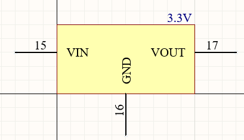

## Add Lib to the project

In order to be able to use our created component:

13. Go to 'Projects' tab
14. Right-click on the <u>.LibPkg</u> file and click on '**Compile integrated library** myCustomLib.LibPkg' 
15. **Remove the installed library and then, reinstall it (from CS)** as described in [Here](#Install-local-library). (The file to select is <u>myCustomLib.IntLib</u>)

## Add component to sheet

16. In CS, select the library from the dropdown menu
17. Select the component and place it into the sheet
18. Add every other needed component according to the datasheet (resistors, capacitors, ground ports)

## Final design 2 (power supply)

Following all previous 18 steps, we get this:

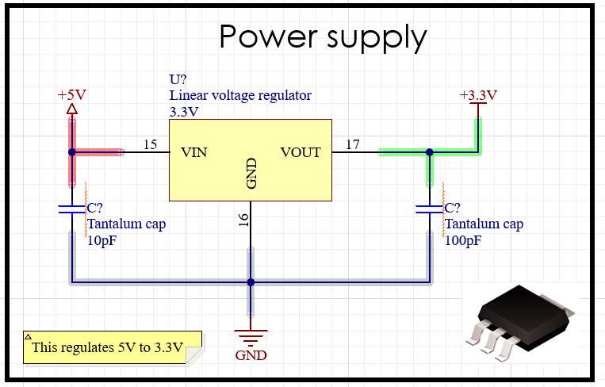

------

# CREATE A CUSTOM FOOTPRINT

## Setting up the Pcb Lib

Having created a custom schematic component, 

1. Right-click on 'myCustomLib.LibPkg' -> Add new to project -> PCB library  
2. `Ctrl + S` and save it as '**myCustomLib.PcbLib**'

The project's tree must look like this:

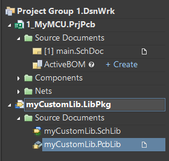 

**In a Pcb Lib we can create Pcb footprints**.

Assuming that, from the datasheet, we saw this config and want to use it for the component

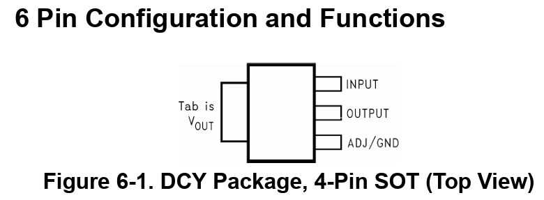

Then, in the new <u>.PcbLib</u> window:

3. Select 'PCBComponent_1' from the left sidebar and rename it to, for example '**4-PIN-SOT**'

4. Look for the component's **height** in the datasheet, it must be in the last pages of the document, contained in the 'Mechanical, Packaging, and Orderable Information'.

There, we'll see a header like 'DCY (R-PDSO-G4); PLASTIC SMALL-OUTLINE' and the dimensions, alonside to some notes:

*All linear dimensions are in millimeters (inches).*

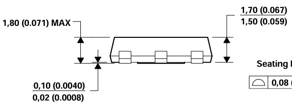

4. Set the height in the AD box. In this case, **1.7 mm** (67 mils)

> [!NOTE]
>
> By writing 'mm' after the number, AD will automatically convert the value to mils.

4. Select 'Top overlay' in the lower bar

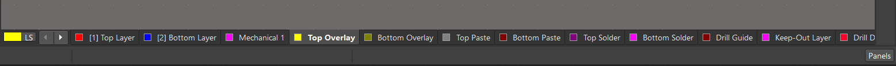

> [!TIP]
>
> By pressing `2` or `3` in keyboard, we can access the 2D and 3D views

## Drawing the component

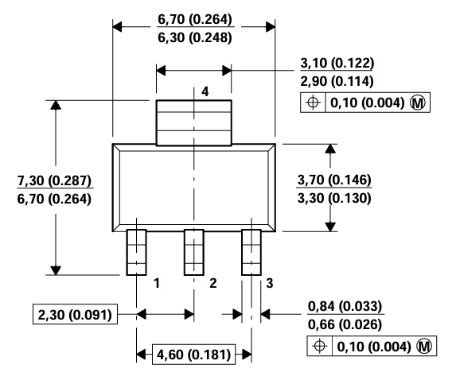

5. Go to PS and change units to **mm**

6. First, draw the **body**. For this:

   - Place a line with `P + L`
   - Press `J + L` and set the **length** (in this case, x=6.7 & y=0)
   - Place another line and set the **width** (in this case, x=6.7 & y=3.7)
   - Select and copy-paste the two lines to get the full body

> [!TIP]
>
> After `Ctrl+C`, AD waits for us to select an starting point to make the copy, we must select the origin (x,y)=(0,0)

What we're trying to achieve with this is merely the outline of the component, as in this picture:

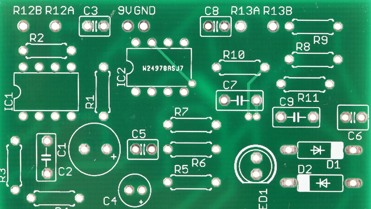

7. Place the **pads** (pins) from the UB

> [!IMPORTANT]
>
> The pads placed will have a default number, we must make them coincide with the ones from our schematic. In this case, they are 15, 16 and 17 for VIN, GND and VOUT, respectively. See the [Pins numbers](#PowerSupply) image.

8. 
